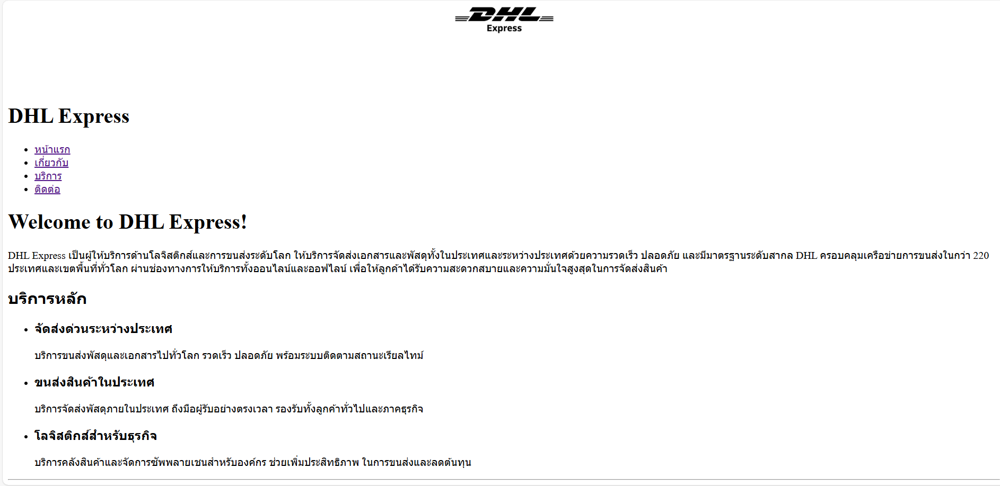
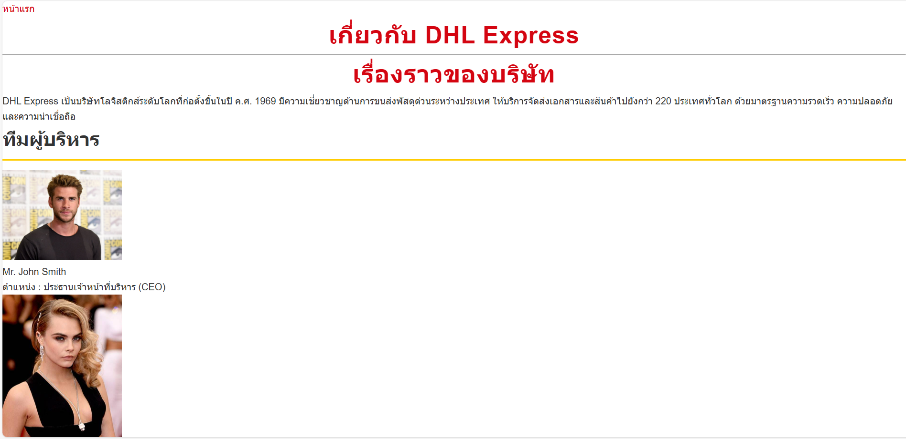
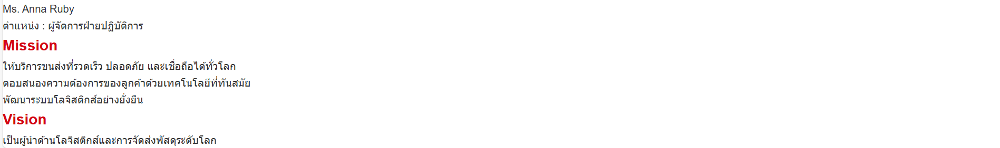
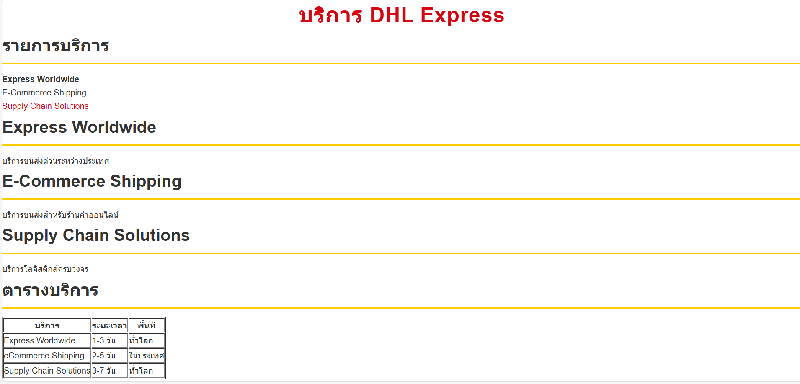
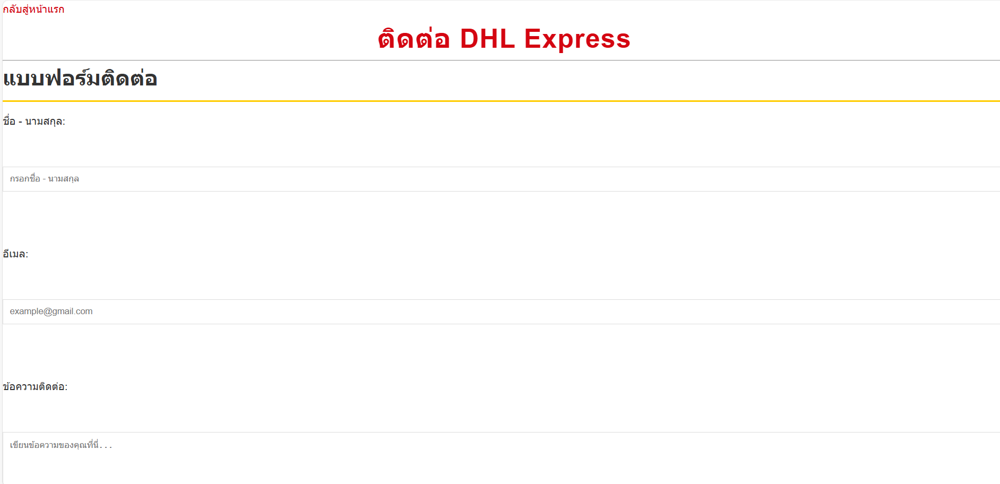
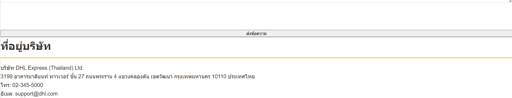

# DHL Express

เว็บไซต์สำหรับบริษัทผู้ให้บริการด้านขนส่งและโลจิสติกส์  
ประกอบด้วยหน้าแรก หน้าเกี่ยวกับบริษัท หน้าบริการ และหน้าติดต่อ

## ฟีเจอร์หลักของเว็บ

- แสดงข้อมูลบริษัท DHL Express
- นำเสนอประวัติบริษัท ทีมงาน Mission และ Vision
- แสดงบริการด้านขนส่งและโลจิสติกส์
- มีตารางเปรียบเทียบบริการ
- มีแบบฟอร์มติดต่อ (Contact Form)
- เมนูนำทางเชื่อมต่อทุกหน้า

## โครงสร้างไฟล์

my-business-web  
├── index.html  
├── about.html  
├── services.html  
├── contact.html  
├── css/
│ └── styles.css 
├── images/  
│ └── logo.png  
│ └── hero-bg.jpg
│ └── ceo.png  
│ └── manager.png 
│ └── contact1.png  
│ └── contact2.png  
│ └── index.png 
│ └── services.png
│ └── about1.png 
│ └── about2.png 
└── README.md

## ลิงก์ไปแต่ละหน้า (Page Links)

[หน้าแรก](index.html)  

[เกี่ยวกับ](about.html)  
  

[บริการ](services.html)  

[ติดต่อ](contact.html)  

